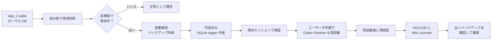

<h1 align="center">Codex Log SQLite Guard</h1>

<p align="center">
  Codex Desktop が <code>~/.codex/logs_2.sqlite</code> に行う異常な TRACE 高頻度書き込みを、診断・緩和・検証・圧縮・整理するための Codex skill です。
</p>

<p align="center">
  <a href="./README.md">English</a>
  ·
  <a href="./README.zh.md">中文</a>
  ·
  <a href="./README.ja.md">日本語</a>
</p>

<p align="center">
  
  
  
  
  
</p>

---

## 何をするものか

Codex Log SQLite Guard は、実際の Codex Desktop ログ churn 調査を、再利用可能で保守的、検証しやすいワークフローにしたものです。

| シグナル | 得られる情報 |
| --- | --- |
| SQLite サイズ | `logs_2.sqlite`、WAL、SHM、ページ数、空きページ |
| 書き込み活動 | `COUNT`、`MAX(id)`、WAL サイズ、WAL mtime の短時間サンプリング |
| TRACE 圧力 | 最近のログレベル分布と最新ログ時刻 |
| バックアップ判断 | 書き込み前の空き容量確認と、バックアップ有無の比較 |
| 緩和 | `logs` への新規 INSERT を止める可逆的な SQLite trigger |
| 検証 | 緩和直後の確認と、手動再起動後の再確認 |
| 整理 | 検証後の `VACUUM`、WAL truncate、不要バックアップの削除案内 |

このリポジトリには公開しても安全な手順と補助スクリプトのみを含めています。個人ログ、SQLite バックアップ、Codex 会話内容、プライベートなローカルパスは含みません。

## Skill

### `codex-log-sqlite-guard`

| 項目 | 詳細 |
| --- | --- |
| 依存関係 | サードパーティ Python パッケージ不要 |
| 必要な状態 | ローカルの `~/.codex/logs_2.sqlite` にアクセスできること |
| 主な対象 | `logs_2.sqlite`、`logs_2.sqlite-wal`、`logs_2.sqlite-shm` |
| 緩和方式 | `codex_block_logs_insert` という SQLite trigger |
| 再起動方針 | Codex はユーザーに Codex Desktop の手動終了・再起動を依頼する |
| 元に戻す方法 | `DROP TRIGGER` でブロック解除。バックアップがあれば DB 全体を復元可能 |

## フロー



## インストール

Codex にこのリポジトリから skill をインストールするよう依頼します。

```text
https://github.com/tsetsugekka/codex-log-sqlite-guard から codex-log-sqlite-guard をインストールして。
```

一度だけ確認したい場合は、リポジトリを clone してスクリプトを直接実行できます。

## 実行

読み取り専用診断：

```bash
python3 codex-log-sqlite-guard/scripts/codex_log_sqlite_guard.py diagnose --sample-seconds 15
```

容量とバックアップ見積もり：

```bash
python3 codex-log-sqlite-guard/scripts/codex_log_sqlite_guard.py capacity
```

バックアップありで trigger を作成：

```bash
python3 codex-log-sqlite-guard/scripts/codex_log_sqlite_guard.py install-trigger --backup-dir ./work
```

バックアップなしで trigger を作成：

```bash
python3 codex-log-sqlite-guard/scripts/codex_log_sqlite_guard.py install-trigger --no-backup
```

検証後に圧縮：

```bash
python3 codex-log-sqlite-guard/scripts/codex_log_sqlite_guard.py vacuum
```

バックアップ一覧または trigger のロールバック：

```bash
python3 codex-log-sqlite-guard/scripts/codex_log_sqlite_guard.py list-backups --dir ./work
python3 codex-log-sqlite-guard/scripts/codex_log_sqlite_guard.py drop-trigger
```

対象 DB がデフォルトの `~/.codex/logs_2.sqlite` ではない場合のみ、`--db PATH` を指定します。

## 依頼例

```text
codex-log-sqlite-guard を使って、Codex がまだ logs_2.sqlite に高頻度で書き込んでいるか確認して。

~/.codex/logs_2.sqlite に最近 1 分で新規行が増えたか確認して。

先に logs_2.sqlite のサイズと空き容量を計算し、バックアップすべきか教えて。

logs テーブルに trigger を作成し、書き込み停止を確認してから、手動再起動後に再検証して。

Codex 更新後、この trigger がまだ有効か確認して。

高頻度書き込みが止まったので、logs_2.sqlite を圧縮し、バックアップを削除してよいか確認して。
```

## 診断シグナル

| シグナル | 正常 | 疑わしい状態 |
| --- | --- | --- |
| `MAX(id)` | サンプリング中に安定 | サンプリング中に増加 |
| 行数 | 安定、または想定どおりの変化 | TRACE 行が増え続ける |
| WAL サイズ | 安定、または truncate される | 増え続ける、または頻繁に更新される |
| WAL mtime | 繰り返し更新されない | 数秒ごとに更新される |
| 最近のレベル | 混在、または静か | 現在時刻付近で `TRACE` が多い |

## バックアップ判断

| 選択 | 利点 | コスト |
| --- | --- | --- |
| 先にバックアップ | 問題が起きた場合の復元経路が最も安全 | 一時的に DB と同程度の追加容量を使う |
| バックアップなし | 速く、ディスク使用量が少ない | trigger は削除できるが、修正前 DB 内容は復元できない |

## 安全性

| ルール | 詳細 |
| --- | --- |
| 読み取り専用から開始 | DB を変更する前に診断と容量確認を行う |
| 明示的な確認 | trigger 作成、`VACUUM`、バックアップ削除はユーザー確認が必要 |
| 手動再起動 | skill はユーザーに手動再起動を依頼し、Codex を自動で kill しない |
| 方式の範囲 | trigger は SQLite レイヤーの workaround であり、Codex 本体の修正ではない |
| 更新後の確認 | Codex 更新後は、再インストール判断の前に読み取り専用診断を行う |
| リポジトリ衛生 | `logs_2.sqlite`、WAL/SHM、バックアップ、私的ログ、Codex 会話をコミットしない |

## リポジトリ構成

```text
codex-log-sqlite-guard/
  SKILL.md
  agents/
    openai.yaml
  scripts/
    codex_log_sqlite_guard.py
README.md
README.zh.md
README.ja.md
LICENSE
```

## ライセンス

MIT
