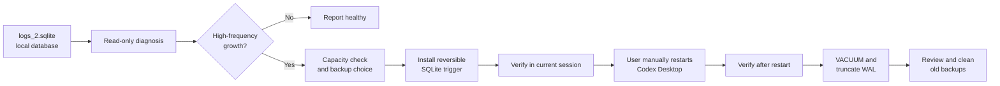

<h1 align="center">Codex Log SQLite Guard</h1>

<p align="center">
  A Codex skill for diagnosing, mitigating, verifying, compacting, and cleaning up abnormal Codex Desktop TRACE writes to <code>~/.codex/logs_2.sqlite</code>.
</p>

<p align="center">
  <a href="./README.md">English</a>
  ·
  <a href="./README.zh.md">中文</a>
  ·
  <a href="./README.ja.md">日本語</a>
</p>

<p align="center">
  
  
  
  
  
</p>

---

## What It Does

Codex Log SQLite Guard turns a real Codex Desktop log-churn investigation into a reusable, conservative workflow:

| Signal | What you get |
| --- | --- |
| SQLite size | `logs_2.sqlite`, WAL, SHM, page count, free pages |
| Write activity | Short-window sampling of `COUNT`, `MAX(id)`, WAL size, and WAL mtime |
| TRACE pressure | Recent log-level distribution and newest log timestamp |
| Backup decision | Disk-free check and backup/no-backup tradeoff before any write |
| Mitigation | A reversible SQLite trigger that blocks future inserts into `logs` |
| Verification | One check immediately after mitigation and another after manual Codex restart |
| Cleanup | `VACUUM`, WAL truncation, and guided backup deletion after verification |

The repository contains only public-safe workflow instructions and helper code. It does not include personal logs, SQLite backups, Codex conversation data, or private local paths.

## Skill

### `codex-log-sqlite-guard`

| Area | Detail |
| --- | --- |
| Dependency | No third-party Python packages |
| Required state | Local access to `~/.codex/logs_2.sqlite` |
| Main target | `logs_2.sqlite`, `logs_2.sqlite-wal`, `logs_2.sqlite-shm` |
| Mitigation | SQLite trigger named `codex_block_logs_insert` |
| Restart policy | Codex asks the user to quit and reopen Codex Desktop manually |
| Reversibility | `DROP TRIGGER` removes the insert block; backups allow full DB restore |

## Flow



## Install

Ask Codex to install the skill from this repository:

```text
Install codex-log-sqlite-guard from https://github.com/tsetsugekka/codex-log-sqlite-guard.
```

For a one-off check, clone the repository and run the script directly.

## Run

Read-only diagnosis:

```bash
python3 codex-log-sqlite-guard/scripts/codex_log_sqlite_guard.py diagnose --sample-seconds 15
```

Capacity and backup estimate:

```bash
python3 codex-log-sqlite-guard/scripts/codex_log_sqlite_guard.py capacity
```

Install the trigger with a backup:

```bash
python3 codex-log-sqlite-guard/scripts/codex_log_sqlite_guard.py install-trigger --backup-dir ./work
```

Install the trigger without a backup:

```bash
python3 codex-log-sqlite-guard/scripts/codex_log_sqlite_guard.py install-trigger --no-backup
```

Compact after verification:

```bash
python3 codex-log-sqlite-guard/scripts/codex_log_sqlite_guard.py vacuum
```

List backups or roll back the trigger:

```bash
python3 codex-log-sqlite-guard/scripts/codex_log_sqlite_guard.py list-backups --dir ./work
python3 codex-log-sqlite-guard/scripts/codex_log_sqlite_guard.py drop-trigger
```

Use `--db PATH` only when the target database is not the default `~/.codex/logs_2.sqlite`.

## Example Prompts

```text
Use codex-log-sqlite-guard to check whether Codex is still high-frequency writing logs_2.sqlite.

Check whether ~/.codex/logs_2.sqlite added new rows in the last minute.

Calculate logs_2.sqlite size and free disk space first, then tell me whether backup is recommended.

Install the trigger on the logs table, verify the writes stopped, then ask me to manually restart Codex and verify again.

After a Codex update, check whether the trigger is still effective.

The high-frequency writes have stopped. Compact logs_2.sqlite and tell me whether old backups can be deleted.
```

## Diagnosis Signals

| Signal | Healthy | Suspicious |
| --- | --- | --- |
| `MAX(id)` | Stable during the sample window | Increases during the sample window |
| Row count | Stable or changes only as expected | Keeps increasing with TRACE rows |
| WAL size | Stable or truncates | Keeps growing or gets touched repeatedly |
| WAL mtime | No repeated updates | Updates every few seconds |
| Recent levels | Mixed or quiet | Dominated by `TRACE` near current time |

## Backup Choice

| Option | Advantage | Cost |
| --- | --- | --- |
| Back up first | Best rollback path if anything goes wrong | Temporarily consumes roughly another database-sized file |
| No backup | Faster and uses less disk space | You can drop the trigger, but cannot restore the pre-mitigation DB contents |

## Safety

| Rule | Detail |
| --- | --- |
| Read-only first | Diagnosis and capacity checks run before any DB write |
| Explicit confirmation | Trigger installation, `VACUUM`, and backup deletion require user approval |
| Manual restart | The skill asks the user to quit and reopen Codex Desktop; it does not kill Codex itself |
| Workaround scope | The trigger is a SQLite-layer workaround, not an upstream Codex source-code fix |
| Update check | After Codex updates, run read-only diagnosis again before deciding whether to reinstall |
| Repository hygiene | Never commit `logs_2.sqlite`, WAL/SHM files, backups, private logs, or Codex conversations |

## Repository Layout

```text
codex-log-sqlite-guard/
  SKILL.md
  agents/
    openai.yaml
  scripts/
    codex_log_sqlite_guard.py
README.md
README.zh.md
README.ja.md
LICENSE
```

## License

MIT
