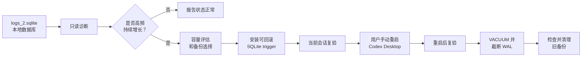

<h1 align="center">Codex Log SQLite Guard</h1>

<p align="center">
  用于诊断、缓解、复验、压缩并清理 Codex Desktop 对 <code>~/.codex/logs_2.sqlite</code> 的异常 TRACE 高频写入。
</p>

<p align="center">
  <a href="./README.md">English</a>
  ·
  <a href="./README.zh.md">中文</a>
  ·
  <a href="./README.ja.md">日本語</a>
</p>

<p align="center">
  
  
  
  
  
</p>

---

## 它会做什么

Codex Log SQLite Guard 把一次实际的 Codex Desktop 日志高频写盘排查，整理成可复用、保守、可验证的流程：

| 信号 | 你会得到什么 |
| --- | --- |
| SQLite 大小 | `logs_2.sqlite`、WAL、SHM、页数、空闲页 |
| 写入活动 | 短时间采样 `COUNT`、`MAX(id)`、WAL 大小和 WAL mtime |
| TRACE 压力 | 最近日志级别分布和最新日志时间 |
| 备份选择 | 修改前先检查磁盘剩余空间，并说明备份/不备份取舍 |
| 缓解方式 | 安装可回滚 SQLite trigger，拦截后续 `logs` 表插入 |
| 复验流程 | 安装后立即验证一次，用户手动重启 Codex 后再验证一次 |
| 清理收尾 | 验证通过后执行 `VACUUM`、截断 WAL，并引导删除无效备份 |

这个仓库只包含公开安全的流程说明和辅助脚本，不包含个人日志、SQLite 备份、Codex 会话内容或私有本地路径。

## Skill

### `codex-log-sqlite-guard`

| 项目 | 说明 |
| --- | --- |
| 依赖 | 不需要第三方 Python 包 |
| 需要状态 | 能访问本机 `~/.codex/logs_2.sqlite` |
| 主要目标 | `logs_2.sqlite`、`logs_2.sqlite-wal`、`logs_2.sqlite-shm` |
| 缓解方式 | 名为 `codex_block_logs_insert` 的 SQLite trigger |
| 重启策略 | Codex 只提示用户手动退出并重新打开 Codex Desktop |
| 可回滚性 | `DROP TRIGGER` 可取消拦截；保留备份时可完整恢复数据库 |

## 流程



## 安装

在 Codex 中请求从这个仓库安装 skill：

```text
请从 https://github.com/tsetsugekka/codex-log-sqlite-guard 安装 codex-log-sqlite-guard。
```

如果只是临时检查，也可以 clone 仓库后直接运行脚本。

## 运行

只读诊断：

```bash
python3 codex-log-sqlite-guard/scripts/codex_log_sqlite_guard.py diagnose --sample-seconds 15
```

容量和备份评估：

```bash
python3 codex-log-sqlite-guard/scripts/codex_log_sqlite_guard.py capacity
```

带备份安装 trigger：

```bash
python3 codex-log-sqlite-guard/scripts/codex_log_sqlite_guard.py install-trigger --backup-dir ./work
```

不备份安装 trigger：

```bash
python3 codex-log-sqlite-guard/scripts/codex_log_sqlite_guard.py install-trigger --no-backup
```

复验通过后压缩：

```bash
python3 codex-log-sqlite-guard/scripts/codex_log_sqlite_guard.py vacuum
```

列出备份或回滚 trigger：

```bash
python3 codex-log-sqlite-guard/scripts/codex_log_sqlite_guard.py list-backups --dir ./work
python3 codex-log-sqlite-guard/scripts/codex_log_sqlite_guard.py drop-trigger
```

只有目标数据库不是默认 `~/.codex/logs_2.sqlite` 时，才需要加 `--db PATH`。

## 示例请求

```text
用 codex-log-sqlite-guard 检查 Codex 是否还在高频写 logs_2.sqlite。

帮我确认 ~/.codex/logs_2.sqlite 最近 1 分钟有没有新增。

先计算 logs_2.sqlite 大小和磁盘剩余空间，再告诉我是否建议备份。

给 logs 表安装 trigger，确认停止写入后让我手动重启 Codex 再复验。

Codex 更新后帮我确认这个 trigger 是否还有效。

现在高频写入已经停了，帮我缩小 logs_2.sqlite 并确认备份能不能删除。
```

## 诊断信号

| 信号 | 正常 | 可疑 |
| --- | --- | --- |
| `MAX(id)` | 采样窗口内稳定 | 采样窗口内增长 |
| 行数 | 稳定或按预期变化 | 随 TRACE 行持续增加 |
| WAL 大小 | 稳定或被截断 | 持续增长或频繁被触碰 |
| WAL mtime | 没有重复更新 | 每几秒更新一次 |
| 最近级别 | 混合或安静 | 当前时间附近主要是 `TRACE` |

## 备份选择

| 选择 | 优点 | 代价 |
| --- | --- | --- |
| 先备份 | 出问题时回滚路径最好 | 临时多占用大约一个数据库大小的空间 |
| 不备份 | 更快、更省磁盘 | 可以删除 trigger，但无法恢复修复前数据库内容 |

## 安全说明

| 规则 | 说明 |
| --- | --- |
| 先只读 | 修改数据库前先做诊断和容量评估 |
| 明确确认 | 安装 trigger、`VACUUM`、删除备份都需要用户确认 |
| 手动重启 | skill 只要求用户手动退出并重新打开 Codex，不会自己 kill Codex |
| 方案范围 | trigger 是 SQLite 层 workaround，不是 Codex 上游源码修复 |
| 更新复查 | Codex 更新后先做只读诊断，再判断是否需要重装 trigger |
| 仓库卫生 | 不提交 `logs_2.sqlite`、WAL/SHM、备份、私有日志或 Codex 会话 |

## 仓库结构

```text
codex-log-sqlite-guard/
  SKILL.md
  agents/
    openai.yaml
  scripts/
    codex_log_sqlite_guard.py
README.md
README.zh.md
README.ja.md
LICENSE
```

## 许可证

MIT
